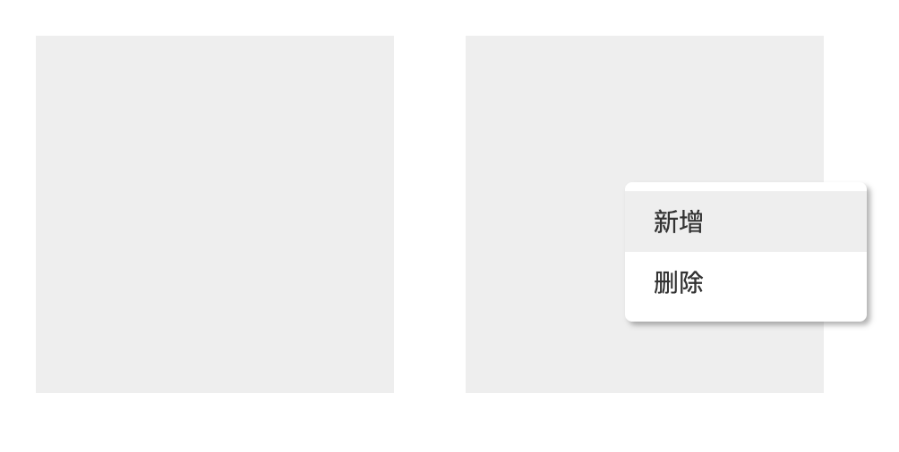

# Vue-Right-Click

> 高度灵活且简易的右键菜单 Vue.js 指令插件



### 安装

在 `Vue-Cli` 项目中你可以这样使用：

```bash
npm install @jaxson/vue-right-click
# or
yarn add @jaxson/vue-right-click
```

全局注入：

```javascript
import VueRightClick from '@jaxson/vue-right-click'

Vue.use(VueRightClick)
```

然后在需要显示右击菜单注入指令即可：

```html
<template>
  <div id="app" class="demo">
    <div v-right-click="rcAction" class="demo-item" />
  </div>
</template>

<script>
export default {
  name: 'App',
  data() {
    return {
      rcAction: [
        {
          name: '新增',
          event: () => {
            console.log('我执行了新增事件')
          }
        },
        {
          name: '删除',
          event: this.deleteAction
        }
      ]
    }
  },
  methods: {
    deleteAction() {
      console.log('我执行删除事件')
    }
  }
}
</script>
```

当然你可以在静态页面使用，只需要引入：

```html
<script src="vue.js"></script><!-- 需要 Vue.js 依赖 -->
<script src="../dist/vue-right-click.umd.js"></script>
```

### Api

未完待续

使用方法请先查看：[test/index.html](./test/index.html) 或者 [src/App.vue](./src/App.vue)

### 更新日志

更新日志参考[版本发布](https://github.com/JaxsonWang/Vue-Right-Click/releases)

### License

Vue-Right-Click is open source and released under the MIT License.
